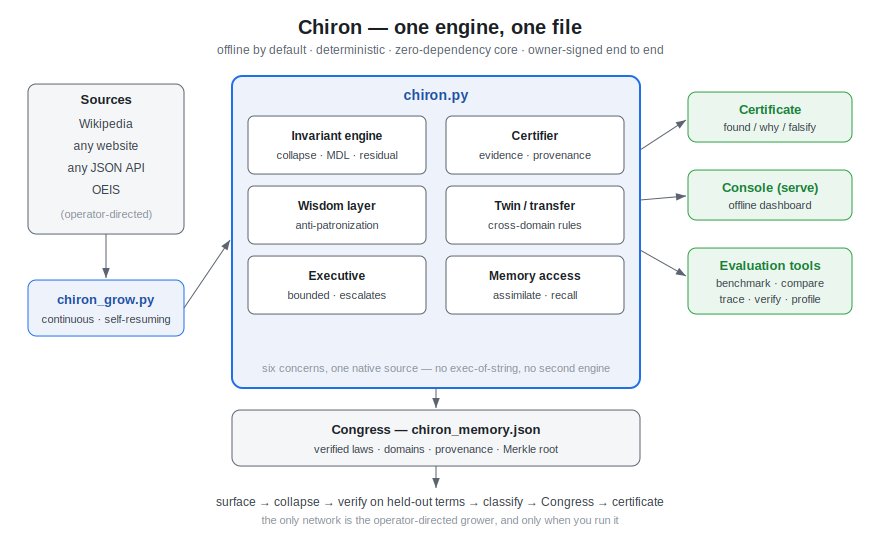

# Architecture

Chiron is **one engine in one file** with a small ring of companions. This is a
deliberate design choice, not an accident of growth, and this document explains
the shape and why it is kept that way.



## The one file: `chiron.py`

The entire engine is defined natively in a single Python file — no `exec()` of
embedded source, no second hidden engine, no third-party packages in the core
path. Inside it, six concerns are organized as clearly separated sections:

1. **Invariant engine** — `collapse`, the hypothesis-class fitters, MDL ranking
   (`top_generators`), residual taxonomy, structural fingerprints, `articulate`
   (the inverse codec).
2. **Certifier** — gates each consequential claim for evidence, counterexamples,
   and provenance; emits the auditable certificate (`human_report`).
3. **Wisdom layer** — scores any explanation for condescension, unearned
   confidence, evasion, and opacity, and renders findings as *what was found, why
   it is believed, what would falsify it.*
4. **Twin / transfer** — same-generator detection across domains; structural
   correspondence.
5. **Executive** — an isolated, bounded agent; network off by default; anything
   irreversible escalates to a human.
6. **Memory (the Congress)** — verified rules persist as compact, owner-bound,
   order-independent records that pool across instances without trust.

### Why a single file

- **Portability and zero install.** One file runs anywhere Python does; the core
  has no dependencies (numpy/scipy are optional accelerators with pure-Python
  fallbacks).
- **Auditability.** A reviewer reads one artifact end to end. The self-test scans
  the core to prove properties (e.g. no network in the core path).
- **Owner-signed integrity.** Hashes and the Merkle root bind the whole record.

A future internal split into modules (`collapse.py`, `residual.py`, …) is on the
roadmap, but only **while preserving the single-file distribution option** —
splitting is not allowed to cost the properties above, so it is deferred until it
can be done behind a build step rather than by fragmenting the source.

## The companions (storage and interface, not dependencies)

| file | role |
|---|---|
| `chiron_grow.py` | the shared grower — pulls from any source (Wikipedia / website / API / OEIS), continuous and self-resuming |
| `chiron_ciphers.py` | cipher/code solver; seeds a cryptography basis |
| `dashboard.html` | the offline operator console (served by `chiron.py serve`) |
| `chiron_memory.json` | the Congress (ships as a clean seed) |
| `parameters.json` + `grow-*/profiles/` | the configuration layer |

## The evaluation tools (additive; the engine is untouched by them)

| file | answers |
|---|---|
| `benchmark.py` | does it work? (OEIS-core + ciphers + adversarial, scored for false positives) |
| `compare.py` | compared to what? (vs gzip / bz2 / lzma) |
| `trace.py` | why does it work? (ranked candidates → winner → verification → residual) |
| `verify.py` | can I reproduce it? (records + determinism digest) |
| `profile.py` | where does the time go? |
| `export_graph.py` | export recovered structure as a knowledge graph (JSON-LD / Markdown / edges) |
| `discover.py` | cross-domain twins — surfaces that share one generator across domains |
| `mine_code.py` | code-repository mining — structural skeletons and clone detection |
| `ingest_pdf.py` | optional PDF source adapter (text + embedded-sequence recovery) |
| `formal_check.py` | property-based soundness check (see [FORMAL.md](FORMAL.md)) |
| `examples/` | worked examples + certificates, regenerated from real output |

## Data flow

```
surface ──▶ collapse ──▶ verify on held-out terms ──▶ classify ──▶ Congress
                                   │                       (integral / general)
                                   ▼
                              certificate  ──▶ articulate (speak the rule back up)
```

Sources feed the grower; the grower feeds `assimilate`; verified rules become
laws in the Congress; the console and the certificate are how a human reads it.
Network is off by default and never essential — engine, Congress, console, and
gates all run fully offline and deterministically.
