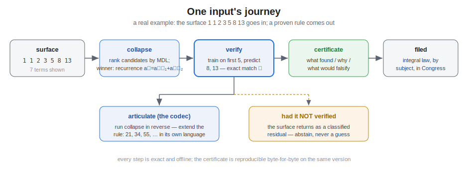
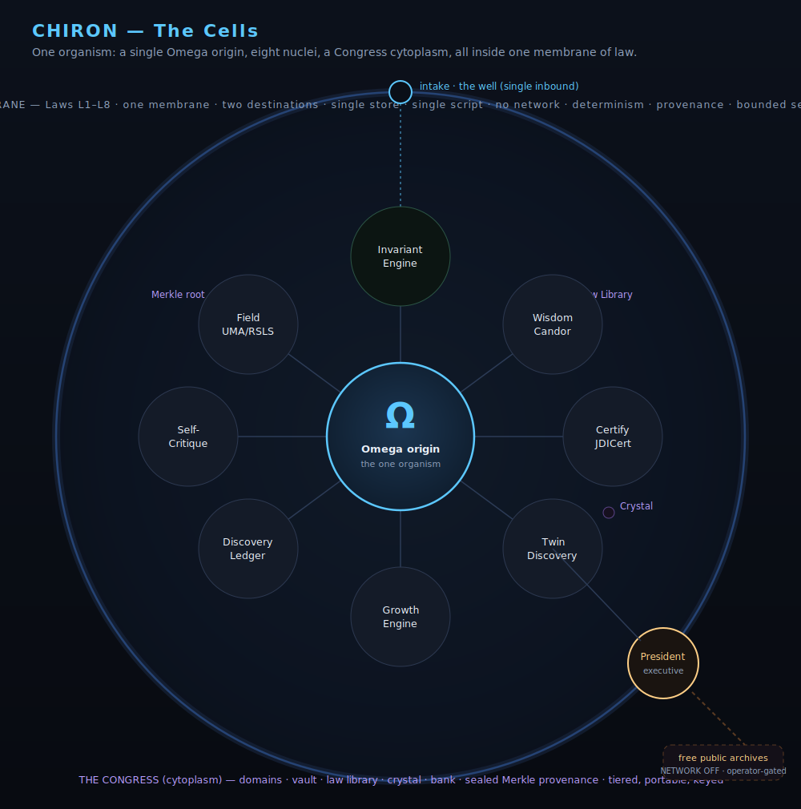

# CHIRON — The Epistemic Organism

**Author: Jacob Iannotti. Licensed under PolyForm Noncommercial 1.0.0 — free to use, modify, and share for any noncommercial purpose; commercial rights reserved (see the repository-root [LICENSE.md](../LICENSE.md)).**


Chiron is one portable, offline, deterministic, self-certifying organism whose
entire purpose is the work nobody has automated: taking an ambiguous,
uncooperative, codified surface and recovering the immutable rule beneath it —
then proving the recovery, certifying it, and refusing, by construction, to
patronize the human reading it.

It is named for the wounded teacher — the one centaur trusted not despite his
doubleness but because of it: the human-and-engine pairing done right.

Chiron is **one self-contained monolith** with a few deliberate companions —
the engine travels in a single file; the rest are storage, the console, and docs:

```
Chiron/
  chiron.py              the whole organism — one self-contained file
  chiron_grow.py         shared grower — any source (Wikipedia / website / API / OEIS), continuous, self-resuming
  chiron_ciphers.py      cipher/code/crypto solver — seeds a 'cryptography' basis
  chiron_memory.json     default Congress for the CLI (ships GROWN; reset point: chiron_memory_clean.json)
  chiron_memory_clean.json   pristine seed — the reset point
  dashboard.html         the offline operator console (served by `chiron.py serve`)
  grow-public/           open grow data (config + memory + profiles/)
    profiles/            ready feeds: oeis.json, oeis-physics.json, regulatory.json
  grow_clean.py          unified clean grower — any file / Wikipedia preset / ingestion-driven, LLM-aided
  president_grow.py      compartmentalized LLM grow service (the model proposes -> chiron verifies)
  epistemic.py           the abstract recovery contract; chiron / semic / governance / energy as instances
  semic_energy.py        three-level stack — exact collapse, then uncertified energy exploration on refusal
  build.py               lossless split/recompile of chiron.py + semic.py (byte-identical gate)
  bench_suite.py         external benchmarks — six tasks vs established baselines
  vault.py               ONE command starts every service + prints one URL (Ctrl-C stops all)
  console_server.py      launcher service — run any function from the dashboard Run tab (:8768)
  assistant_server.py    natural-language assistant — intent -> real engine actions (Chat tab, :8769)
  grow_control.py        start / stop / point the grower from the dashboard (Feed tab, :8767)
  llm_certify.py         accountability certificate over an LLM output (audit + verify its claims)
  chiron_artifact.py     one signed-certificate emit path; build_manifest.py indexes them (artifacts/)
  vault_dashboard.html   the certificate browser (one tile per script + what would falsify it)
  parameters.json        default grower config (topics, source, thresholds)
  tests/                 test_chiron.py · test_grow.py (run by CI)
  requirements.txt       numpy required; scipy optional (pure-Python fallback)
  README.md  ·  GROW.md  this document · the grower guide
  cells.svg  ·  system.svg  ·  journey.svg   diagrams
  chiron.key             created only on first `seal` (movable; gitignored, never pushed)
```

The `chiron_memory.json` shipped in this folder is a **grown Congress** — the engine's
accumulated, verified knowledge. `chiron_memory_clean.json` is the pristine seed, and
`chiron_grow.py --reset` returns to it, so a fresh clone can also start empty and grow
its own.

## Diagrams

**The system** — sources, the shared grower (public + private), the offline monolith,
the Congress, bounded self-growth, and what comes out.


**One input's journey** — surface → collapse → verify on held-out terms →
integral or general → filed by subject → certificate → concept → spoken back.



**The cells** — one organism: a single Omega origin, the nuclei, a Congress cytoplasm, all inside one membrane of law.



---

Everything Chiron *runs on* is inside `chiron.py`. The Invariant Engine, the
Certification core (JDICert), the Wisdom layer (Candor), the Twin/Transfer
engine, the field-cognition substrate (UMA/RSLS), and the executive companion
(President) are all a **single unified engine, defined natively in the file** —
no `exec()` of embedded source, no base64, no second engine. The companions
above are storage and interface, not dependencies; the monolith stands alone.

---

## The core law (everything else is subordinate)

```
collapse(surface)          -> the generator beneath it          (knowledge)
same_origin(a, b)          -> do two surfaces share one rule?   (equivalence)
cast(generator, target)    -> a new surface, same skeleton      (transfer)
```

A *surface* is anything codified — integer sequences, strings, ciphers, graphs,
Python code, schemas, combinatorial spaces. `collapse` returns the **minimal**
generator under a two-part **Minimum Description Length** criterion, in **exact**
`fractions.Fraction` arithmetic, and **verifies** it by predicting held-out
terms it never saw (exact equality, not a tolerance). Whatever it cannot
compress is returned as the **residual**, classified — never hidden.

`collapse` is only half of a **codec**. `articulate` is the inverse: it pushes an
invariant back *up* into a surface — regenerating and extending the original in its
own language, or re-voicing the same generator into a new vocabulary — and reports
round-trip fidelity. Each digested work carries its **author** through the codec,
distinct from the owner who signs the artifact: Chiron speaks in the language of
what it consumed, and knows whose language it is.

## In 60 seconds

```bash
python3 chiron.py collapse 1 2 4 8 16 32 64   # -> geometric (ratio 2), verified; predicts 128, 256, ...
python3 chiron.py solve "WKLV LV D VHFUHW"    # -> caesar_shift_3: THIS IS A SECRET
python3 trace.py "1 1 2 3 5 8 13"             # -> the ranked candidates, the winner, the proof
```

**Why not just fit a curve, or run gzip?** A curve-fit never says "I don't know" —
it returns a confident wrong answer on anything it cannot actually model; gzip
shrinks the bytes but cannot tell you the rule or predict the next term. Chiron
returns the **exact** generator with a held-out proof, or an honest abstention —
compared head-to-head in `compare.py`, explained in [WHY_CHIRON.md](WHY_CHIRON.md).

## Running it

From inside this folder:

```bash
python3 chiron.py serve                       # OFFLINE operator console (localhost)
python3 chiron.py selftest                    # run the full embedded gate suite
python3 chiron.py demo                        # self-contained demonstration

# the unified engine, straight from the command line
python3 chiron.py collapse 1 1 2 3 5 8 13     # recover + prove a generator
python3 chiron.py topk 1 4 9 16 25            # ranked competing hypotheses
python3 chiron.py explain 2 4 8 16 32         # machine view + human view
python3 chiron.py articulate 1 1 2 3 5 8 13   # speak it back UP through its invariant (the codec)
python3 chiron.py solve "WKLV LV D WHVW"      # crack a cipher/code ciphertext-only (Caesar/ROT/Atbash/base64/hex/binary/Morse)
python3 chiron.py audit "Obviously it works." # candor (anti-patronization) audit
python3 chiron.py same-origin "1 2 3" :: "9 18 27"   # provable twins
python3 chiron.py twins                       # the quintillion-scale twin proof

# the Congress: ingest, grow, certify, persist
python3 chiron.py ingest "SATOR AREPO TENET OPERA ROTAS"
python3 chiron.py run <folder> --memory chiron_memory.json   # ingest a tree, grow, persist
python3 chiron.py state                       # the Congress' current state
python3 chiron.py attest --memory chiron_memory.json         # attestation manifest + root

# keyed, authenticated Congress storage (offline, stdlib)
python3 chiron.py seal   chiron_memory.json   # -> chiron_memory.sealed (+ creates chiron.key)
python3 chiron.py unseal chiron_memory.sealed # requires the key to be present

# growth, scale & the swarm
python3 chiron.py gauntlet                              # labeled benchmark: recovery + zero false-verify
python3 chiron.py merge other_congress.json --memory chiron_memory.json   # pool laws across nodes (idempotent)
python3 chiron.py checkpoint                            # immutable sealed snapshot you can restore
python3 chiron.py compact                               # tiered-memory distillation view

# self-growth (bounded) and the optional native hot-path
python3 chiron.py grow-concepts --memory chiron_memory.json   # grow cross-domain concepts from proven laws
python3 chiron.py self-growth                           # concepts, multi-domain families, self-edit status
python3 chiron.py proposals                             # list quarantined self-change proposals
python3 chiron.py apply-proposal <id>                   # apply ONE only if backup taken AND selftest stays GREEN
python3 chiron.py bench-native                          # compile + time the optional C hot-path (Python fallback)
```

Run with no arguments for the banner plus a self-test summary.

## The operator console (`serve`)

`python3 chiron.py serve` starts a local, **offline** web console (bound to
`127.0.0.1`, no network egress) backed by the unified engine and the Congress;
it auto-opens `http://127.0.0.1:8765`. Tabs: **Analyze** (collapse/ingest any
input, with the certificate and the codec's "spoken back"), **What it knows**
(domains, laws, items), **Growth** (proven vs general, **yield %**, cross-domain
transfers, live curve, tiered memory, the law ledger), **Feed** (redirect what
the grower consumes — Wikipedia / website / API / OEIS — picked up on its next
pass), **Self-growth** (grown concepts), **System** (run the gate suite + native
benchmark), and **Glossary**. It reads the live Congress (reloads are rate-limited
so it stays responsive even while a grow writes to the file). Run it on its own,
or together with a crawl in one command: `python3 chiron_grow.py --serve`.

## Keyed storage (the Congress, sealed)

The Congress can be sealed into an authenticated container (`chiron_memory.sealed`)
under a 256-bit key kept in `chiron.key`. The key must sit beside the monolith to
open a sealed Congress; **move it out to lock the store, restore it to open** —
a wrong or absent key is refused. Confidentiality is a SHA-256 keystream;
integrity and authentication are HMAC-SHA256. Offline, standard library only.

## Growth — domains, organisms, and what's integral

Chiron consumes and grows. Every input is sorted by the engine's own read of it
(numeric, text, code, graph, figure) into a **domain** in the Congress: a new
domain is born the first time a structurally-distinct kind of material is seen,
and the same kind extends it. Each finding is then classified —

- **Integral** — a *verified, reusable* generator. It joins the law library and
  can recur across domains; the same generator showing up in a second domain is a
  measurable **cross-domain transfer**.
- **General** — retained as knowledge in the Congress vault.

The Growth Engine tracks integral vs general, unique generators, and cross-domain
transfers over time — watch it in the dashboard's **Growth** tab (live curve,
tiered-memory bars, replayable discovery ledger). Memory is tiered (raw items →
compressed parts → verified invariants → generators) so the Congress stays
portable as it grows, and large `run`s seal incrementally. A new **organism**
(capability) is minted only when a reasoning cycle meets structure its charts
can't cleanly read and the candidate passes the gate — non-colliding, runnable,
still able to reject. That gate is the discernment.

## The Return certificate

Every analyzed input yields a stakeholder certificate — an **executive headline**
(what was found, the decision it supports, the confidence, and the cost of being
wrong) over an **engineer appendix** (model class, fingerprints, residual, memory
tiers, provenance, and a one-line reproduction). Read it in the console or
download it as Markdown.

## Network

Off by default. Any external lookup (free public archives) is **operator-directed
and never essential** — the engine, the Congress, the console, and the gates all
run fully offline and deterministically.

## Growing it continuously — `chiron_grow.py`

`chiron_grow.py` is the **shared grower**: one local, network-capable engine
(separate from the offline monolith) that pulls the current Congress, ingests from
**any source** — Wikipedia (keyless), any website (HTML→text, following links as a
self-extending frontier), or any JSON API — feeds each item through `assimilate`
under its subject, grows cross-domain concepts, and pushes the grown Congress back
when it fills (saving locally **and** to GitHub). It resumes where it left off three
ways over (local cursor, the cursor committed to git, and the Congress's own
`ingested_sources` ledger), and **auto-compacts** past `max_congress_mb`, so it runs
forever without bloating the repo.

It drives any folder via `--params`. Two grows ship configured:

```bash
# the public, Pull-Request-contributable grow
python3 chiron_grow.py --params grow-public/parameters.json
# OEIS integer sequences — STRUCTURED data, ~100% law yield (the engine's strength)
python3 chiron_grow.py --params grow-public/profiles/oeis.json --once
# regulatory & governmental law into a 'regulation' domain
python3 chiron_grow.py --params grow-public/profiles/regulatory.json --once

# the default grow (one command = crawl + live dashboard)
python3 chiron_grow.py --params grow-public/parameters.json --serve
nohup python3 chiron_grow.py --params grow-public/parameters.json > grow.log 2>&1 &   # background; tail -f grow.log

# or the unified clean grower — any file / Wikipedia preset / ingestion-driven, LLM-aided
python3 grow_clean.py ingest ./material.txt --llm

# flags (any profile)
python3 chiron_grow.py --params <cfg> --dry-run   # offline demo (no network, no git)
python3 chiron_grow.py --params <cfg> --once      # a single pass
python3 chiron_grow.py --params <cfg> --reset     # back to a clean seed + clear cursor
```

Wikipedia needs no API key (just a descriptive User-Agent); other sources are
configured under `source` in each `parameters.json`. Outside contributors grow
`grow-public/` and open a Pull Request. See **GROW.md** and **grow-public/README.md**
for the full guides.

## Ciphers, codes & crypto

Decoding is squarely the engine's home turf — recovering a transform is the same
move as recovering a generator. Given a plaintext/ciphertext pair,
`collapse(a, b)` recovers the key (Caesar shift or substitution map); given just
the ciphertext, `chiron.py solve "<text>"` cracks it (Atbash, ROT13, all Caesar
shifts, A1Z26, base64, hex, binary, Morse, reversal), ranked by English-likeness.
`python3 chiron_ciphers.py` solves a whole corpus and seeds a **cryptography**
basis into the Congress — recovered transforms recorded as verified laws — a
strong foundation to grow on. It writes only the Congress, never the crawl cursor,
so the Wikipedia crawl resumes untouched afterward.

The symbolic organism runs on **bare Python 3** with no third-party packages.
The field-cognition layer uses **numpy** and **scipy** as mathematical
accelerators when present; if they are absent, Chiron says so honestly and the
symbolic engine runs unchanged.

## The memory file (`chiron_memory.json`)

`chiron_memory.json` is Chiron's persistent memory — the companion store that
travels with the monolith. It holds the verified law library, the manifest
rooms, the provenance vault/bank, tombstones, and a Merkle `root` that binds the
whole record together and is owner-signed.

- `python3 chiron.py run <folder> --memory chiron_memory.json` loads the store
  if it exists, ingests the folder, and writes the updated memory back.
- `python3 chiron.py attest --memory chiron_memory.json` loads it and prints the
  attestation manifest and root.

The file shipped here is a **grown** Congress written by Chiron itself. To regenerate a
pristine clean seed instead (the reset point):

```bash
python3 -c "import chiron; print(chiron.Chiron().save_memory('chiron_memory.json'))"
```

Verified laws persist as canonical, owner-bound JSON records that are
order-independent and idempotent under merge — two instances can pool knowledge
without trusting each other's compute.

## The six nuclei (all native in `chiron.py`)

1. **Invariant Engine (Veritas)** — generator recovery, MDL, multi-hypothesis
   ranking (`top_generators`), residual taxonomy, structural fingerprints.
2. **Certification Engine (JDICert)** — every consequential claim is gated for
   evidence, counterexamples, and provenance; reproducibility, not trust.
3. **Wisdom Engine (Candor)** — scores reasoning for condescension, unearned
   confidence, evasion, and opacity; the Human Translation Layer renders every
   finding as "what was discovered, why it is believed, what would falsify it."
4. **Twin / Transfer Engine** — same-generator detection across domains and the
   O(1) bijection between quintillion-scale combinatorial spaces.
5. **Executive (President)** — the agentic OODA companion, isolated so it may
   reach the world without violating the offline core. It deliberates against
   six tenets of executive judgment, decides under a candor gate, and records to
   a hash-chained ledger. Network is OFF unless `PRESIDENT_ALLOW_NETWORK=1`; the
   action set is bounded; anything irreversible escalates to a human.
6. **Memory / Law Library** — verified rules persist as compact, owner-bound,
   order-independent records that pool across instances without trust (see
   `chiron_memory.json` above).

## Hypothesis classes recovered

Constant, arithmetic, geometric, polynomial (any degree), linear recurrences
(C-finite, including sums/products of polynomial × geometric), periodic,
multiplicative (factorial-type), alternating, holonomic / P-recursive (Catalan,
central-binomial, Motzkin-class), and **interleaved composites** — k independent
lanes (k = 2, 3, 4), each following its own rule, shuffled by position. Whatever
none of these compress is returned as a classified residual.

## Built-in ground truth

Carried in-file: the twin labyrinths of Caramuel's *Primus Calamus* (1663) —
Tabula XXVI (IESUS SOL) and XXVII (MARIA STELLA), two maximally different
surfaces that collapse to ONE generator emitting 279,608,910,057,308,160 valid
verses. They are the organism's permanent calibration anchor and signature
proof.

## Hard laws (each gated in `selftest`)

L1 single membrane · L2 two destinations · L3 single store · L4 single script ·
L5 no network / no external inference (the core is scanned to prove it; only the
President submodule is network-capable, by design and off by default) · L6
determinism · L7 unbroken provenance · L8 bounded self-modification. A gate also
confirms Veritas and President are natively integrated with no exec-of-string.

## The Primus atlas, verses & the native hot-path

The two twins above are the built-in calibration; the full transcribed atlas —
Infectatrum's 21 plates (TAB XIII–XXXIII, six languages) — runs through the same
engine:

```bash
python3 primus_atlas.py      # collapse all 21 plates; cross-plate structural twins
python3 primus_verses.py     # reconstruct each plate's ductus verses + proteus generation
```

All 21 collapse and verify, and `same_structure` isolates exactly the XXVI⇔XXVII
twin. Curated non-plate items (the *Tot tibi* proteus verse; the n! permutation
table, which `collapse` recovers) are in `primus_extra/`, hand-entered and marked as
such. Background: `../PRIMUS_EXPLORATION.md`.

An **optional** native hot-path lives in `chiron_fastops/` (a Rust crate — exact
`poly_degree` and a hexameter foot-checker over the C ABI, plus a WASM target),
loaded by `fastops.py`, which falls back to exact pure-Python everywhere, so nothing
is ever required:

```bash
python3 fastops.py               # native if built (cargo), else identical pure-Python
python3 chiron.py bench-native   # the embedded C kernel + timing
```

## Evaluation & honest limits

Beyond `selftest`, three reproducible, offline tools let anyone check the claims:

```bash
python3 benchmark.py      # OEIS-core + ciphers + adversarial, scored for FALSE POSITIVES
python3 compare.py        # head-to-head vs gzip / bz2 / lzma (structure recovery vs byte compression)
python3 trace.py "1 1 2 3 5 8 13"   # the full ranked-candidate reasoning path, with verification
python3 discover.py                  # cross-domain twins: one proven rule across domains
python3 formal_check.py             # property-based soundness check (see FORMAL.md)
python3 mine_code.py                # code mining: structural skeletons + clones
```

Measured: **22/29** OEIS-core sequences recovered (all 22 in-scope), **42/44**
classical ciphers cracked ciphertext-only, and **0 false positives** across
~5,070 scored cases — corrupted inputs abstain rather than fabricate a rule, and
the naive polynomial baseline that cannot abstain is confidently wrong on 18 of
the same 29. Where the engine stops — prose yield, non-closed-form sequences,
what "verified" does and does not mean, and what is not externally audited — is
documented plainly in **[WHY_CHIRON.md](WHY_CHIRON.md)** and
**[KNOWN_LIMITATIONS.md](KNOWN_LIMITATIONS.md)**.

## Verifying

```bash
python3 chiron.py selftest
```

The full embedded suite runs green, offline and deterministically — the organism
gates, the convergence gates (6/6), the invariant-operation gates (23/23), and
the Chiron-core gates (12/12). One artifact. Offline. Exact. Owner-signed end to
end.
