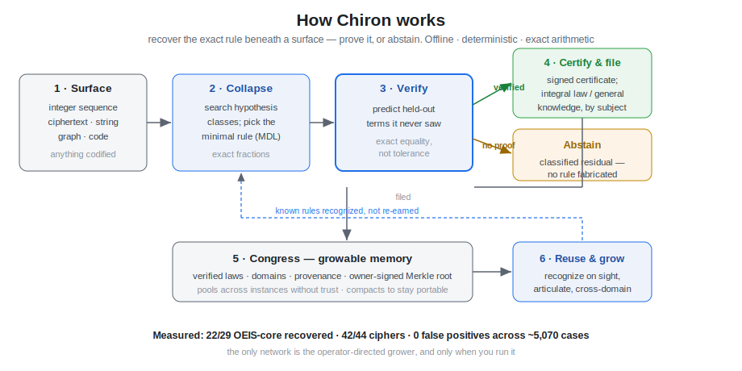

++Jacob Iannotti's Portfolio++

In practice I am a semantic brutalist. In computational language I am a nascent. In discovery I am unrelenting. In inner song I am a son, an intimate, and a countryman. This is the year-long span and real-time progress of my systems building. This repository contains the core body of my technical and theoretical work. It is presented in descending order of current relevance and maturity.

***

Each work below stands on its own in its folder, with its own README; together they form one lineage that culminates in Chiron. They are listed in descending order of current relevance and maturity — the flagship first, then its organs, then the theory and the early work that fed them.

**Chiron — the flagship.** One portable, offline, deterministic, self-certifying organism, and the ascension of everything below it. Its purpose is the work nobody has automated: take an ambiguous, uncooperative, codified surface and recover the immutable rule beneath it — not match it, *recover* it, and then prove the recovery. The core law is three operations: *collapse* a surface to its minimal generator, test whether two surfaces *share* one hidden generator across any disguise, and *cast* that generator into a new domain. It runs on a two-part Minimum Description Length criterion in exact fractional arithmetic, so "verified" means a held-out prediction matched on the nose — equality, not tolerance — and whatever it cannot compress is handed back as a classified residual rather than swept under confidence. It is a single self-contained file: the invariant engine, the wisdom layer, the certification core, the field substrate, and the executive unified in one monolith, offline and owner-signed end to end. And it *grows* — it ingests files, datasets, code, and entire systems and assimilates them into a persistent **Congress** of organisms it can navigate, certify, and reuse, kept portable and private behind a movable cryptographic key. It ships with an offline operator console (`serve`) and returns, on every run, an auditable certificate of what was discovered and what to do with it. Built for the messiest problem there is: chaotic data, a lost specification, domains that don't speak, and a decision that still has to be staked on the structure underneath. It is also a **codec** — `articulate` runs *collapse* in reverse, speaking a recovered rule back out (regenerating, extending, or re-voicing it) and carrying the digested work's own author. And it grows continuously, on a leash: one shared grower feeds it from Wikipedia, any website, or any API into a **public** Congress anyone can extend by pull request and a **private** Congress only I run; it grows its own cross-domain concepts from proof, and can even propose changes to its own source — applied only if a reversible backup is taken first and its full self-test stays green, so it can improve itself but never take anything away.

**JDICert — the certification core.** A portable system for high-stakes decision certification, rehabilitated to a domain-neutral civilian standard. It ingests a structured situation, propagates competing world-models under physics-informed dynamics, applies regulatory and governance gates (EU AI Act, GDPR, NIST AI RMF, ISO/IEC 42001), defeats hallucination through a free-energy mechanism, and emits cryptographically-signed, court-admissible certificates — each carrying belief-delta tracking, structured escalation packets for human judgment, a full compliance matrix, and Merkle chaining for institutional memory. Certification here is not trust; it is reproducibility.

**Veritas — the knowledge-and-wisdom engine.** The exact-arithmetic heart of *collapse / same_origin / cast*, plus the wisdom half: multi-hypothesis ranking of competing generators, residual taxonomy, an O(1) constant-time transcoder between quintillion-scale spaces, and a Human Translation Layer that renders every finding as *what was discovered, why it is believed, and what would falsify it.* Standard-library only — it runs alone, and lives natively inside Chiron as readable source.

**Candor — the wisdom pillar.** An anti-patronization engine that scores any reasoning across condescension, unearned confidence, evasion, and opacity, and decomposes each point of the score into the exact span that caused it. Its "bridge" makes provenance the cure for opacity; the reverse bridge forces every explanation the system emits to pass its own audit before it ships.

**Infectatrum — the ambiguity crucible.** A monolithic program that operationalizes Juan Caramuel y Lobkowitz's *Primus Calamus* (1663) as a living engine for ambiguity and information-loss. It ingests any codified object — text, poem, lattice, grid, graph — builds its full reading spectrum across multiple ducts, measures ambiguity quantitatively (spectrum cardinality, Shannon entropy, per-cell load, excluded negative space), classifies it, resolves or preserves productive ambiguity, infers origin signatures, and keeps strict provenance. It works on the residue of what is lost under compression while growing an emergent language, *Infecticon*. *Infecticon* is that language — discovered and compressed from the accumulating library of resolution transformations rather than hand-designed; its primitives are stable, composable, quotiented patterns whose core unit is the *transition*, not the static symbol.

**President — the executive.** The agentic companion, deliberately isolated from the deterministic core so it may reach the world without violating the offline laws. It runs an OODA loop over free public archives (Wikidata, Internet Archive, DPLA, Europeana), weighs options against six tenets of executive judgment, and clears every decision through the Candor gate before acting. Its action set is bounded to gathering and deliberation; anything irreversible escalates to a human. Accountability sits where the judgment sits.

**The theoretical spine.** *Holographic Continuity Theory* is the formal theory and Projection Calculus beneath the certification substrate — identity persistence under transformation, provenance as a conservation law, significance as geometric curvature. *Governance* collects the operating doctrine: *LexGuard*, a mathematically-derived four-point gate check on logic against system and safety parameters, and *SoCPM (A Standard of Care for Persuasive Machines)*, the standard for AI making high-stakes recommendations across Map / Measure / Manage / Govern. *UMA (Unified Mathematical Architecture)* is the computational-physics framework that became Chiron's field substrate — the pivot from pure numerical simulation toward hybrid symbolic reasoning inside real-time decision loops; *PIH Unified / Closed Theory* explores variational principles for dynamical systems with endogenous uncertainty. The *Ontological & Philosophical Books* (the Compendium and the five Calculus volumes) are the first-principles ground the engineering grew from.

**Early & exploratory work.** The *Throughput Semantic Engine* was an early attempt to standardize information mediums — video, audio, music, language — into one semantic space; it was doomed in its first form but remains strong scaffolding. The *Quack System Constructs* — Compendium's Prime Epilogue, the Resonant Manifold, early white papers — are kept and labelled honestly: attempts that did not meet scientific standards, preserved for the rigor learned in making them and the occasional seed that survived into the certification program.

**Video Transcription Program.** A standalone, fully-automated pipeline written for a family member's business — converting ~100 hour-long meetings into single, speaker-attributed minutes, built around the operator as the person in the middle balancing compute and size limits.

+On Semantics & AI+

Semantics is meaning, and is feeling, but what I've always tried to impart into semantics is emotion. It never fit before I built the certification program; that, and the Holographic Continuity Theory, were my final grappling with an emotive substrate. People want to know what a vibe is, what vibe-coding is. Artificial intelligence will hallucinate — but that is not the danger, not next to one's own responsibility for assigning meaning and discerning truth. The true danger is machine patronization, non-communication, and information loss, all while accountability stays minimal and self-reference goes un-contextualized.

Deployed systems architecture should never be vibe-coded by a machine or administered by one; theirs is just a non-contextual vibe as well. A human architectural envisioning must accompany rigorous human auditing and leashed automation to push deployable architecture. Non-deployable problem solving, however, just needs a human to vibe until true — if they aren't under delusion. That is the door for scientific machine-language vibe-coding to aid STEM and the arts: so long as the human can comprehend and articulate, and the math holds, academic and institutional gatekeeping decays while human innovation gains traction. It is how I built most of the above. Without LLM-augmented development, this portfolio would not exist.

+Closing+

What artificial intelligence lacks isn't more ontological drivers or more constraint — it is an emotive substrate to instantiate agentic context. My main mechanism for understanding is my own internal emotional state in relation to what I perceive another's to be. I see machine misalignment as, at root, an emotional misunderstanding: articulate the emotion uniformly, standardize it throughout, and the semantic ontologies of computational aspiration finally know what they were missing. If you measure a fish by its ability to climb a tree it will never sum. Put a fish on a drone in the night sky, though — and maybe Pisces is more than two.

+Legal & Contact+

All works within this repository are the sole property of Jacob Iannotti and cannot be used or distributed without his expressed written consent. For inquiry: jiannotti5040@gmail.com
